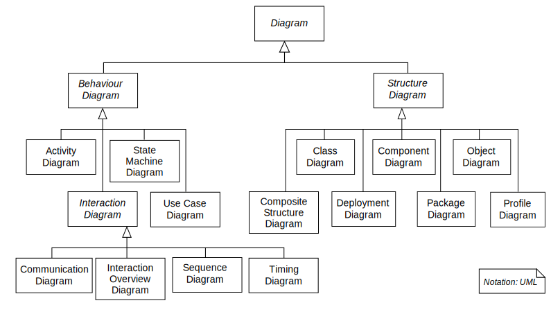

# playground-uml

## Reference

- [https://www.omg.org/spec/UML/](https://www.omg.org/spec/UML/)
- [https://en.wikipedia.org/wiki/Unified_Modeling_Language](https://en.wikipedia.org/wiki/Unified_Modeling_Language)
- [https://creately.com/blog/diagrams/uml-diagram-types-examples/](https://creately.com/blog/diagrams/uml-diagram-types-examples/)

## Illustrate

---

* Structure Diagrams
    - Class Diagram (类图)
    - Component Diagram (构件图)
    - Deployment Diagram (部署图)
    - Object Diagram (对象图)
    - Package Diagram (包图)
    - Profile Diagram (轮廓图)
    - Composite Structure Diagram (复合结构图)
* Behavioral Diagrams
    - Use Case Diagram (用例图)
    - Activity Diagram (活动图)
    - State Machine Diagram (状态机图)
    - Sequence Diagram (序列图)
    - Communication Diagram (通信图)
    - Interaction Overview Diagram (交互概述图)
    - Timing Diagram (时序图)

---
