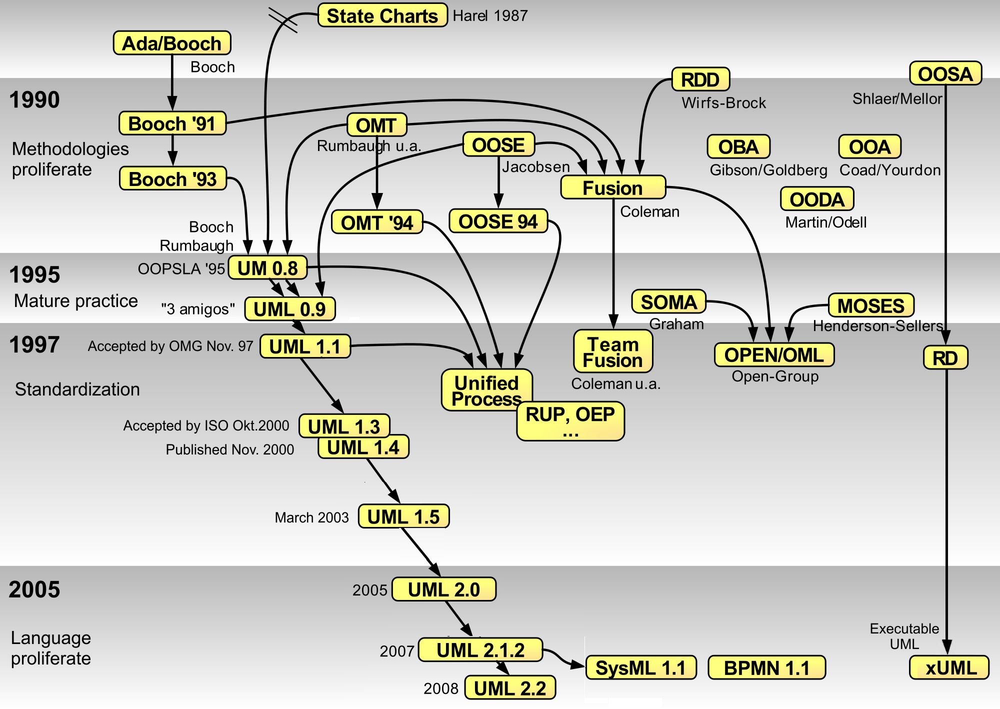

UML 图概览

UML 类型|目的|版本
---|---|---
类图|类图描述了系统中对象的类型以及它们之间存在的各种静态关系|UML 1.x
对象图|对象图是类图的一个实例，是系统在某个时间点的详细状态的快照|UML 1.x
部署图|部署图描述了系统内部的软件如何分布在不同的节点上|UML 1.x
组件图|组件图描绘了系统中组件提供的、需要的接口、端口等，以及它们之间的关系|UML 1.x
轮廓图|轮廓图提供了一种通用的拓展机制，用于为特定领域和平台定制 UML 模型|UML 2.0
组合结构图|组合结构图描述了一个组合结构的内部结构，以及他们之间的关系|UML 2.0
包图|包图描绘了系统在包层面上的结构设计|UML 2.0
||
用例图|用例图指由参与者、用例、边界以及它们之间的关系构成的用于描述系统功能的视图|UML 1.x
活动图|活动图描述了具体业务用例的实现流程|UML 1.x
状态机图|状态机图描述了对象在它的整个生命周期里响应不同事件时执行相关事件的顺序|UML 1.x
序列图|序列图描述了在用例的特定场景中，对象如何与其他对象交互|UML 1.x
通讯图|通讯图描述了收发消息的对象的组织关系，强调对象间的合作关系而不是时间顺序|UML 1.x 协作图
时序图|时序图被用来显示随时间变化，一个或多个元素的值或状态的更改|UML 2.0
交互概览图|交互概览图与活动图类似，但是它的节点是交互图|UML 2.0
